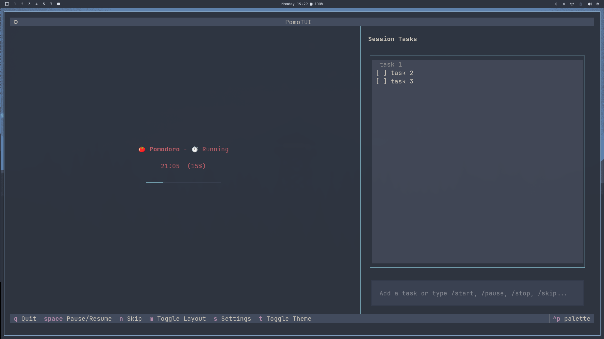
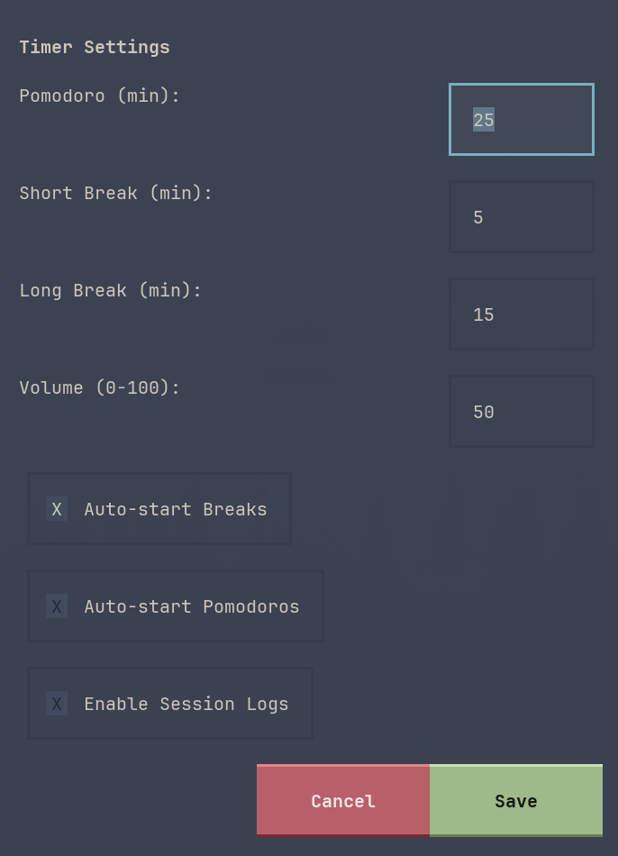

# PomoTUI


A feature-rich Pomodoro Terminal User Interface (TUI) built with Python and the [Textual](https://textual.textualize.io/) framework. Keep track of your focus sessions, rest automatically, and jot down tasks to preserve your workflow.



## Features

- **Split Dashboard**: View your timer and your session's task queue side-by-side.
- **Task Queue**: Jot down ideas or distractions on the fly during a Pomodoro, and check them off when completed.
- **Customizable Timers**: Adjust Pomodoro, Short Break, and Long Break durations to your liking.
- **Auto-Transitions**: Configure the app to automatically start breaks or pomodoros.
- **Layout Toggles**: Switch to a minimal view showing only the timer for maximum focus.
- **Color Themes**: Built-in support for Nord, Catppuccin Mocha, and Dracula themes.
- **System Notifications**: Uses native Linux `notify-send` and FreeDesktop sounds `paplay` when a timer completes.
- **Session Logging**: Optionally log completed Pomodoros to a file `~/.config/pomodoro_tui/session.log`.

## Installation

This project uses `uv` for modern, fast Python dependency management. To set it up:

```bash
git clone https://github.com/Str4vinci/PomoTUI.git
cd PomoTUI
uv sync
```

## Usage

You can run the application directly via the terminal by setting up a global command:

```bash
mkdir -p ~/.local/bin
ln -s $(pwd)/run.sh ~/.local/bin/pomotui
```

Then simply type:

```bash
pomotui
```

### Keybindings

- `space`: Pause or Resume the timer.
- `n`: Skip the current timer and move to the next phase.
- `m`: Toggle Minimal layout.
- `s`: Open the Settings modal.
- `t`: Cycle through color themes (Nord, Catppuccin, Dracula).
- `q`: Quit the application.
- `ctrl+p`: Open Textual's built-in command palette.

### Slash Commands
You can also control the timer directly from the Task Queue by typing these commands and pressing `<Enter>`:
- `/start`
- `/pause`
- `/stop`
- `/skip`

## Configuration

Settings are accessible inside the app (press `s`) and are applied instantly to the current session. You can manage durations, auto-transitions, session logging toggle, and the **Notification Volume**. The task queue explicitly runs in-memory and resets automatically when the application is restarted.
